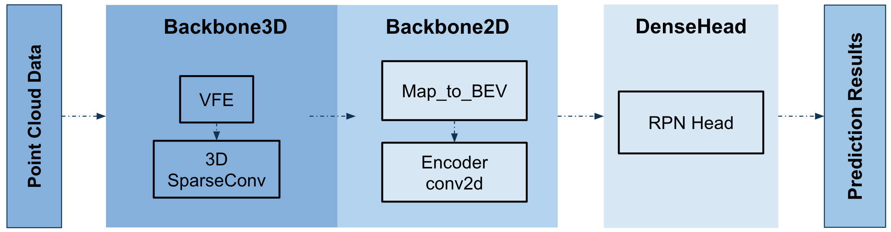

# CenterPoint Detection Relocalization based on CenterPoint

3D Object Detection and Relocalization using center points in dataset [3RScan](https://github.com/WaldJohannaU/3RScan) and [Scannet](http://www.scan-net.org/).

  

> [**3D Object Detection and Relocalization in Indoor Scenes**](https://www.overleaf.com/project/61f8ab85e71e3f6d8f6e7a91),            
> Yiheng Xiong, Jingsong Liu        

We provide two configs, [rio_model.yaml](tools/cfgs/rio_configs/rio_model.yaml) for the centerpoint model on RIO Scannet and [scannet_model.yaml](tools/cfgs/scannet_configs/scannet_model.yaml) which execute centerpoint on ScanNet.

##Installation
1. download the dataset (3RScan and Scannet).
2. refer [readme](https://github.com/tianweiy/CenterPoint/blob/master/README.md) of origin CenterPoint repo to install all dependencies.

## Acknowledgement

Our code is based on [OpenPCDet](https://github.com/open-mmlab/OpenPCDet) and [CenterPoint](https://github.com/tianweiy/CenterPoint). Some util files are copied from [mmdetection](https://github.com/open-mmlab/mmdetection) and [mmdetection3d](https://github.com/open-mmlab/mmdetection3d). Thanks OpenMMLab Development Team for their awesome codebases.
